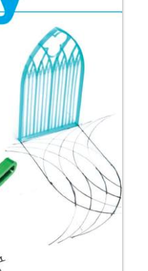

# Mandala
OpenSCAD to draw an Islamic-style 3D Mandala

by David Phillip Oster Inspired by https://www.instructables.com/A-Mathematical-Art-Piece/ 10/20/2021

That instructable walks you through designing the files for laser cutting using drawing software
like Illustrator or Inkscape. But that process loses all the symmetries so if you want to make
changes, you have to either draw the whole thing again from the beginning, or laboriously select
and edit vertices, one vertex at a time.

Mandala1.scad here builds a simple OpenSCAD object  easily into the layered
.

OpenSCAD is great for this kind of art: Its modules capture the symmetries, and its customizer
lets you quickly try variations, or edit the code to make more substantial changes.

This file  Mandala1.scad is self contained. It builds up a 2-D line drawing API:

* segment - draws a line segment
* polyline - draws a array of 2D points, connecting the dots
* arcline - draws a circular arc, from start angle to end angle, approximated using polyline.
* squareline - draws a square centered on the origin.

The next layer defines the polar coordinate grid this will use:

* baseGrid - the pure polar coordinate grid
* grid - adds a containing square

* zigzagring draws a sawtooth ring, connecting every other grid point in ring N with the alternating
gridpoint in ring n+1. It's built from zigzagring2

* zigzagring2 takes two radii explictly so it isn't restricted to adjacent rings.

* mandala2D - draws the full mandala as a 2D object, taking a parameter to let you thicken

* mandala - extrudes mandala2D into a 3D object 

* mandala3d - puts all this together, stacking and coloring the successively offset mandala.

* main - does the final clipping.

This is just the beginning - with a small change to the source you could save individual layers
as .stl files, using pieces of filament to align the layers, as documented in
[Print Things Bigger Than Your 3D Printer](https://www.instructables.com/Print-Things-Bigger-Than-Your-3D-Printer/).

The cover of [Make:Geometry](https://www.amazon.com/Make-Geometry-coding-printing-building/dp/1680456717?)
shows a gothic arch  constructed of line segments and arcs. The same
 techniques in this .scad could be used that way.

Since the mandala is a flat square, it could be tiled with variations on any flat surface. I bet,
if the layers of the Mandala are close together, it would even work vertically without supports.
